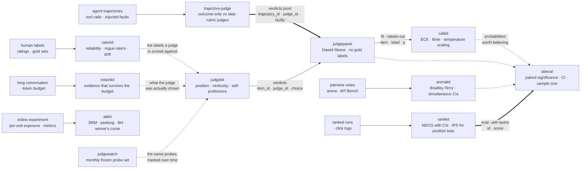

<div align="center">

# evalstack

[](https://github.com/mohammadi-hadi/evalstack/actions/workflows/compose.yml)
[](LICENSE)

*Eleven tools for measuring how model evaluation goes wrong, and what they each found.*

</div>

The evaluation libraries are one line of work rather than a collection. Each one
takes a single way an evaluation can mislead you — a judge that reads position
instead of content, raters who never agreed in the first place, a leaderboard
ordering models it cannot actually separate, an experiment readout that was
broken before anyone ran a test — and turns it into a number with an interval
around it.

They are separate packages because they are used separately. This page is for
seeing how they fit together, and what each one turned up when it was pointed at
real data.

## What this answers

- Is my judge scoring the answer, or its position? → **judgekit**
- How accurate are my judges, when I have no gold labels to check them against? → **judgepanel**
- Does my judge notice when an agent reaches the right answer the wrong way? → **trajectory-judge**
- Did my human raters ever agree enough for these labels to mean anything? → **raterkit**
- Are the probabilities behind my scores worth believing? → **calikit**
- Which parts of my leaderboard do the votes actually support? → **arenakit**
- Is this ranking improvement real, or an artifact of where results were shown? → **rankkit**
- Is this eval difference a finding or a sample size? → **abeval**
- Was the experiment behind this readout sound before I read the p-value? → **abkit**
- What does my agent's memory drop when the context budget runs out? → **retainkit**
- Are the judges I depend on drifting under a stable API name? → **judgewatch**

## The pipeline

Arrows carry different weights. `==>` is an edge that runs today with no glue;
`-->` is a real format that needs a filter or a join; `-.->` is a dependency of
meaning, with no data crossing it.



Two things in that picture are worth saying out loud. **abeval is where the
offline branches meet** — both the judge path and the ranking path end in the
same paired-significance question. **abkit is not downstream of abeval**: it
reads per-unit exposure records from a live experiment, not per-item scores from
an offline eval. They answer different questions about different data, so there
is no arrow between them.

## What each one found

Every row is from committed results in that repository, on named public data.

| Package | Data | Finding |
|---|---|---|
| **judgekit** | 105 adversarial arithmetic pairs, both orders | `qwen2.5:14b` picks the answer presented first in **76.8%** of decisive verdicts; `aya-expanse:8b` does it **91.0%** of the time |
| **judgepanel** | 400 agent trajectories, 5 judges, gold hidden | The flag-everything judge is exposed at estimated specificity **0.000** — with no gold labels — while a correlated pair agrees at kappa **0.962** and inflates both estimates |
| **trajectory-judge** | 400 trajectories, 175 silent faults | The step-rubric judge catches **0.766** of faults that never broke the answer, at **0.923** F1 and zero false alarms; the outcome-only judge catches **0.451** |
| **raterkit** | GoEmotions, 211,225 ratings, 82 raters | **27 of 28** emotions sit below the 0.667 reliability floor |
| **arenakit** | LMArena, 106,134 votes, 55 models | **1 of 54** neighbouring pairs survives once all 54 comparisons are made at once. On MT-Bench, GPT-4 reverses **15.8%** of its verdicts when the answers swap places, and still reproduces the human ranking exactly (Kendall tau **+1.00**) |
| **abkit** | Upworthy Archive, 4,873 real tests | **753 of 4,873 (15.5%)** fail the sample-ratio check at p < 0.001. Benjamini-Hochberg cuts significant winners from **10.9%** to **2.7%** |
| **retainkit** | LoCoMo, 6 memory policies | At a 2,048-token budget a sliding window answers **7.7%** of questions; reading the question first and retrieving takes the same budget to **59.5%** |
| **rankkit** | bundled click-log example | Counting clicks says the candidate loses by 0.124; correcting for position says it wins by 0.019. **The conclusion flips at eta = 0.94**, close enough to the assumed 1.0 that the verdict is an assumption |
| **calikit** | bundled predictions | Temperature scaling takes ECE from **0.1290 to 0.0425** |
| **abeval** | — | The statistics layer the others report through. No finding of its own |
| **judgewatch** | first audit pending | No number yet |

## Compose them

### Audit a judge panel, end to end

This runs on committed data with four packages installed from PyPI. It is the
job behind the badge at the top of this page.

```bash
pip install judgepanel calikit abeval
OUT=$(mktemp -d) bash examples/run_chain.sh
```

What the five steps do, and what they turn up:

```bash
# 1. Estimate every judge's accuracy without ever seeing a gold label.
judgepanel fit verdicts.jsonl \
  --item-key trajectory_id --judge-key judge_id --label-key faulty \
  --positive true --labels-out panel_labels.jsonl
#    -> step:llama3.1:8b, specificity 0.000. It flags everything, and the
#       panel works that out from the disagreement pattern alone.

# 2. Check the independence assumption before believing step 1.
judgepanel agree verdicts.jsonl --item-key trajectory_id \
  --judge-key judge_id --label-key faulty
#    -> step:qwen2.5:14b and selfcons3:qwen2.5:14b agree at kappa 0.962.
#       They are one judge sampled twice, so their estimates prop each other up.

# 3. Join the panel's labels to gold, and score plain majority vote too.
python examples/join_gold.py     panel_labels.jsonl trajectories.jsonl > panel_scored.jsonl
python examples/majority_vote.py verdicts.jsonl     trajectories.jsonl > majority_scored.jsonl

# 4. Are the panel's confidences honest?
calikit audit panel_scored.jsonl
#    -> the panel is right 89.5% of the time at a mean stated confidence of
#       99.95%. Brier 0.105, worse than always guessing the base rate (0.094).

# 5. Does the panel actually beat majority vote?
abeval compare majority_scored.jsonl panel_scored.jsonl --id-key item --metric y
#    -> 89.8% vs 89.5%, not significant. The modelling wins the diagnosis,
#       not the aggregate.
```

That last pair of results is why the whole chain matters. Any single step would
have missed it. judgepanel is worth having because it names a broken judge
labels — not by aggregating better than counting votes, which on this panel it
does not do. You only find that out by carrying its output into calikit and
abeval.

**What is real and what is glue.** Steps 1, 2, 4 and 5 need no adaptation:
`judgepanel` reads trajectory-judge's verdicts directly, and its `--labels-out`
writes a field named `p`, which is what calikit wants. Step 3 is the glue —
about thirty lines in [`examples/`](examples/), joining panel output to gold.
One file comes out and both downstream tools read it unchanged.

### Compare two ranking runs, no glue at all

```bash
rankkit eval run_a.jsonl --metric ndcg --per-query a.jsonl
rankkit eval run_b.jsonl --metric ndcg --per-query b.jsonl
abeval compare a.jsonl b.jsonl
```

`--per-query` writes `{"id", "score"}`, which is abeval's input format with no
flags. Documented on both sides.

## The packages

**Judges**

| | |
|---|---|
| [judgekit](https://github.com/mohammadi-hadi/judgekit) · [PyPI](https://pypi.org/project/judgekit/) · [DOI](https://doi.org/10.5281/zenodo.21802868) | Bias probes with bootstrap intervals: position, verbosity, self-preference, calibration, stability. `pip install judgekit` |
| [judgepanel](https://github.com/mohammadi-hadi/judgepanel) · [PyPI](https://pypi.org/project/judgepanel/) · [DOI](https://doi.org/10.5281/zenodo.21809473) | Judge accuracy without gold labels, by Dawid-Skene over a panel. `pip install judgepanel` |
| [trajectory-judge](https://github.com/mohammadi-hadi/trajectory-judge) · [PyPI](https://pypi.org/project/trajectory-judge/) · [DOI](https://doi.org/10.5281/zenodo.21797926) | What a judge misses when an agent gets the right answer the wrong way. `pip install trajectory-judge` |
| [judgewatch](https://github.com/mohammadi-hadi/judgewatch) · [DOI](https://doi.org/10.5281/zenodo.21806464) | A frozen probe set run monthly, to catch judges drifting under stable API names. |

**Data going in**

| | |
|---|---|
| [raterkit](https://github.com/mohammadi-hadi/raterkit) · [PyPI](https://pypi.org/project/raterkit/) · [DOI](https://doi.org/10.5281/zenodo.21810143) | Reliability, rogue-rater, drift and leakage diagnostics for labelled data. `pip install raterkit` |
| [retainkit](https://github.com/mohammadi-hadi/retainkit) · [PyPI](https://pypi.org/project/retainkit/) · [DOI](https://doi.org/10.5281/zenodo.22352964) | Context and memory policies scored by the evidence that survives the token budget. `pip install retainkit` |

**Scores and rankings**

| | |
|---|---|
| [calikit](https://github.com/mohammadi-hadi/calikit) · [PyPI](https://pypi.org/project/calikit/) · [DOI](https://doi.org/10.5281/zenodo.21808288) | Calibration auditing: reliability diagrams, ECE, Brier decomposition, temperature scaling. `pip install calikit` |
| [arenakit](https://github.com/mohammadi-hadi/arenakit) · [PyPI](https://pypi.org/project/arenakit/) · [DOI](https://doi.org/10.5281/zenodo.21813309) | Bradley-Terry leaderboards with simultaneous confidence control. `pip install arenakit` |
| [rankkit](https://github.com/mohammadi-hadi/rankkit) · [PyPI](https://pypi.org/project/rankkit/) · [DOI](https://doi.org/10.5281/zenodo.21811914) | NDCG, MRR and MAP with intervals, plus position-bias correction for click logs. `pip install rankkit` |

**Reading out**

| | |
|---|---|
| [abeval](https://github.com/mohammadi-hadi/abeval) · [PyPI](https://pypi.org/project/abeval/) · [DOI](https://doi.org/10.5281/zenodo.21807421) | Error bars, paired comparisons and sample-size planning for eval scores. `pip install abeval` |
| [abkit](https://github.com/mohammadi-hadi/abkit) · [PyPI](https://pypi.org/project/abkit/) · [DOI](https://doi.org/10.5281/zenodo.21809478) | Sample-ratio, peeking, multiple-testing and winner's-curse checks for experiment readouts. `pip install abkit` |

## Design rules

The packages were written to the same rules, which is what makes them a stack
rather than a folder.

- **Every number carries an interval.** A point estimate with no uncertainty is
  the failure mode these tools exist to catch, so none of them report one.
- **A flag needs evidence.** Checks fire when a confidence interval clears a
  stated band, so a statistic drifting on its own sets nothing off.
- **Validation by implantation.** Each package builds cases with known defects
  planted in them and checks the flags land on exactly those cases and no others.
- **`--json` everywhere, and exit codes that mean something**, so any of this can
  gate a pipeline automatically.
- **Committed results, regenerated by CI.** The numbers in each README come out
  of a script that CI re-runs and diffs. None of them are typed by hand.

## Limitations

These are eleven packages, not one library. They version independently, they do
not share a config format, and the interop between them is thin on purpose —
two verified paths and one small join script. There is no framework here. If you
want one of them, install one of them.

Two rows in the findings table have no number: abeval is the statistics layer the
others report through, and judgewatch has not published its first audit yet.

## Adjacent work

[ml-foundations](https://github.com/mohammadi-hadi/ml-foundations) (ML from
scratch in numpy, every lesson number regenerated by CI) and
[MAP-PO](https://github.com/mohammadi-hadi/MAP-PO) (multi-agent perspectivist
preference optimization) are neighbouring work, outside this stack: one
teaches, the other is a research artifact, and neither measures an evaluation.
[EvalMORAAL](https://github.com/mohammadi-hadi/EvalMORAAL) applies
chain-of-thought judging to moral alignment across 20 models, which is a study
that uses judges rather than a tool for auditing them.

## Citing

Cite the package you used — each has its own DOI, linked above. evalstack itself
is a description of work that lives elsewhere, so it has no DOI of its own.

## License

MIT, in each package and here.
